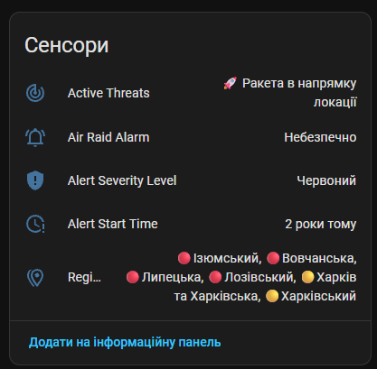
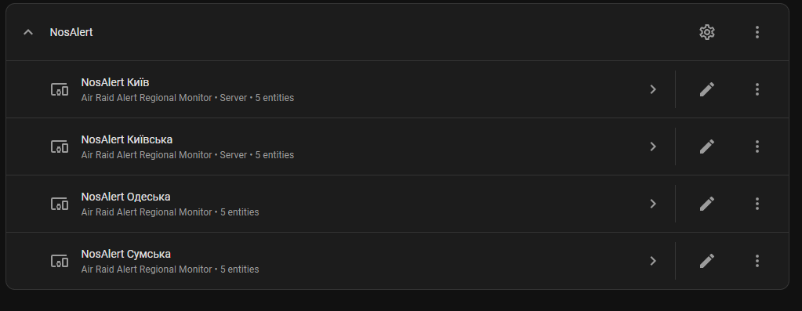

# NosAlert - Ukraine Air Raid Alerts for Home Assistant 🚨

[🇺🇦 Читати українською](README.uk.md)

A custom integration for **Home Assistant** that connects to the official REST API [alerts.in.ua](https://devs.alerts.in.ua/#documentationgetting_started) to provide real-time information about air raid alerts and threats across regions of Ukraine.

<p align="center">
  
  
</p>

---

## ✨ Features

* 🗺 **Automatic Sensor Creation:** Automatically creates a comprehensive set of sensors for each region, district, or hromada you choose to monitor.
* 🔴🟡 **Alert Level Color:** A dedicated sensor clearly shows the current danger level (Red — alert, Yellow — partial alert, Clear) with dynamic safety icons.
* 📡 **Active Threat List:** The active threats sensor outputs a readable list of exactly what is approaching (e.g., "Shahed UAVs", "Cruise Missiles", "Ballistics").
* ⚡ **Real-time Updates:** Continuously updates all sensors every **10 seconds**, ensuring the fastest delivery of alerts without exceeding API rate limits (8–10 requests/min).
* 🌐 **Full Localization:** Supports both English and Ukrainian languages for all entity names and states.
* 🚨 **Easy Automations:** Entities use appropriate device classes (`device_class`: Safety, Timestamp, Enum, Measurement), making them perfect for triggering your own sirens and notifications.

---

## 📦 Installation

### Method 1: HACS (Recommended) ⭐️

1. Open **HACS** in your Home Assistant.
2. Navigate to the **Integrations** section.
3. In the top right corner, click the **three dots** (⋮) ➔ **Custom repositories**.
4. Fill in the fields:
   * **Repository:** `https://github.com/hulakov/NosAlert`
   * **Category:** `Integration`
5. Click **Add**.
6. Select the **NosAlert (Ukraine Air Raid Alerts)** card in the list and click **Download**.
7. **Restart Home Assistant** (**Settings** ➔ **System** ➔ **Restart**).
8. Go to **Settings** ➔ **Devices & Services** ➔ **Add Integration** ➔ search for **NosAlert**.
9. Enter your API token from `alerts.in.ua` and select the regions to monitor.

---

### Method 2: Manual Installation

1. Copy the [`custom_components/nos_alert`](custom_components/nos_alert) folder into your Home Assistant directory:
   ```text
   /config/custom_components/nos_alert/
   ```
2. Restart Home Assistant.
3. Go to **Settings** ➔ **Devices & Services** ➔ **Add Integration** ➔ search for **NosAlert**.

---

## 🧩 Integration Entities

For each selected region, the integration creates the following set of entities:

| Entity | Type | Device Class | Description / Possible States |
|---|---|---|---|
| `binary_sensor.<region>_air_raid_alert` | Binary Sensor | `safety` | **Alert Status** (`Unsafe` / `Safe`) |
| `sensor.<region>_color` | Sensor | `enum` | **Alert Level** (`Air Raid Alert! (Red)`, `Partial Alert (Yellow)`, `Clear`) |
| `sensor.<region>_active_threats` | Sensor | — | **Active Threats** (e.g.: *"Shahed UAVs, Cruise Missiles"* or *"Clear"*) |
| `sensor.<region>_start_time` | Sensor | `timestamp` | **Alert Start Time** (ISO 8601 date/time) |
| `sensor.<region>_affected_regions` | Sensor | — | **Affected Regions** (list of districts/hromadas under alert within the oblast) |

Additionally, the entity attributes (`extra_state_attributes["threats_detail"]`) store a full array of objects containing detailed threat data and source messages from the API.

---

## 💻 CLI Tool

The repository also includes a standalone Python CLI tool for checking active alerts, history, and monitoring via the console.
Documentation for the CLI tool can be found in **[`cli/README.md`](cli/README.md)**.
